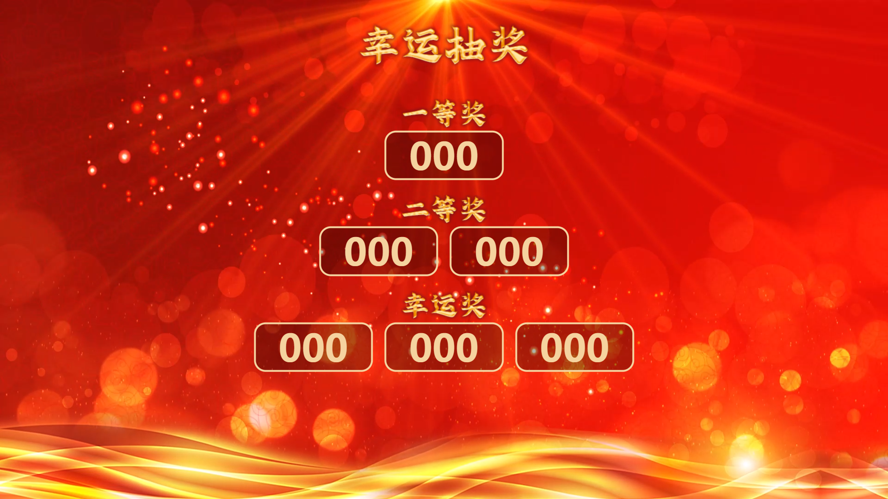
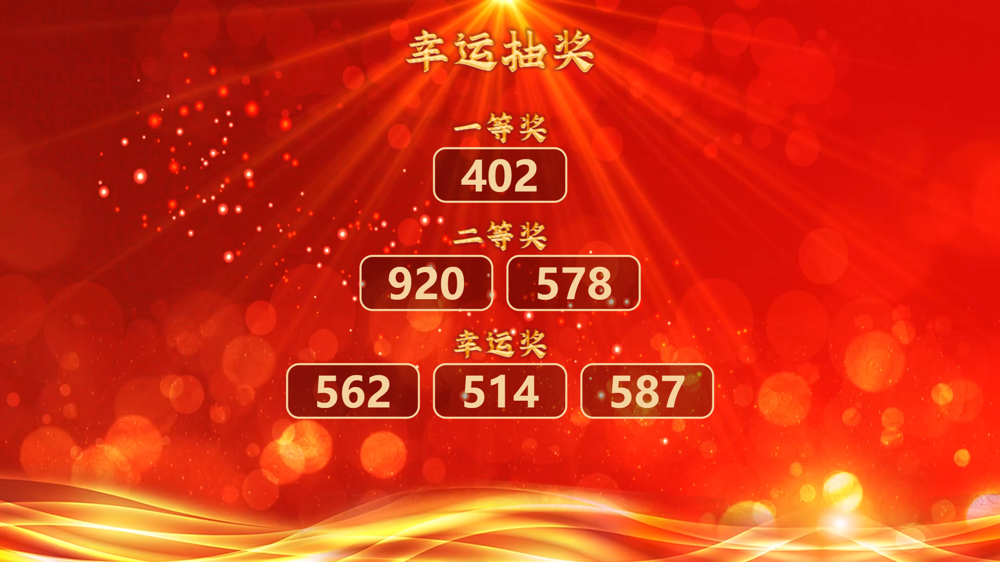
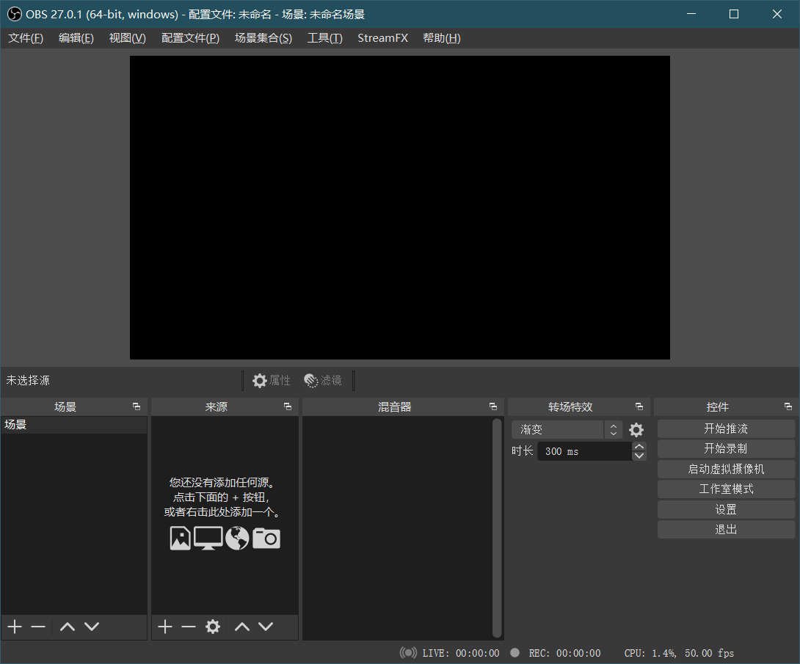
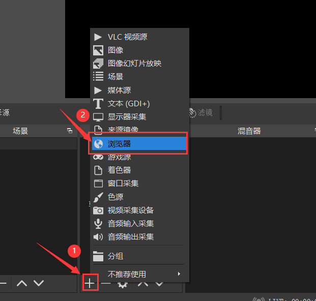
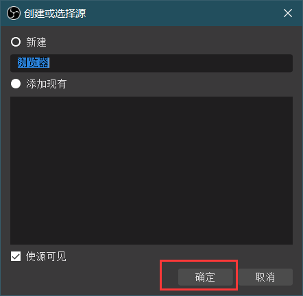
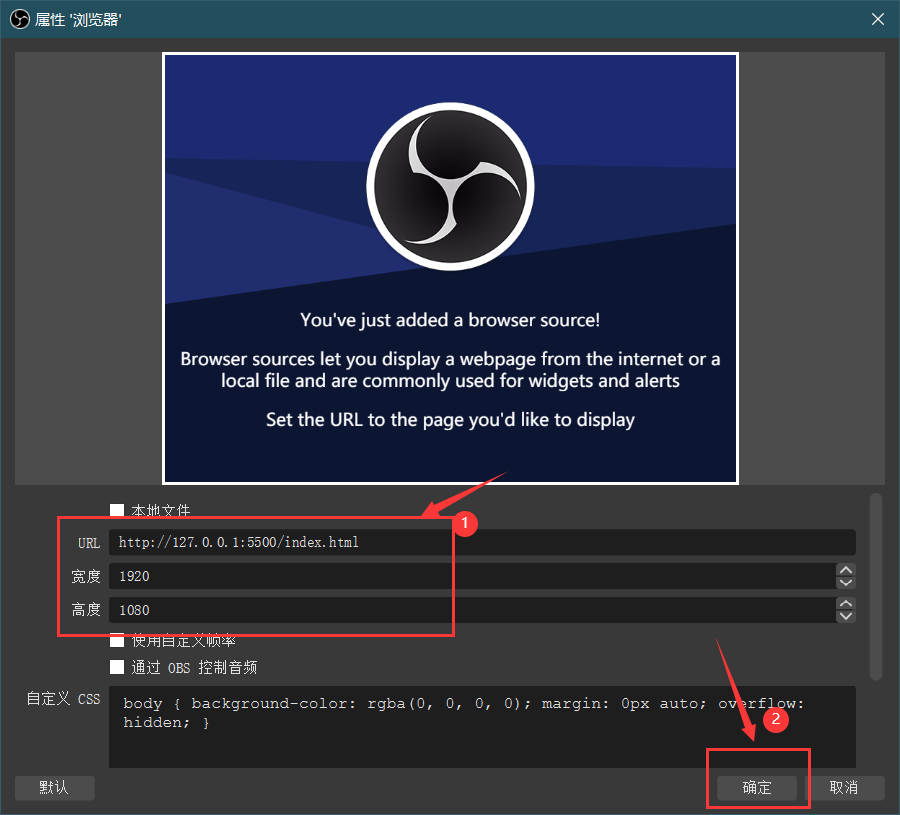
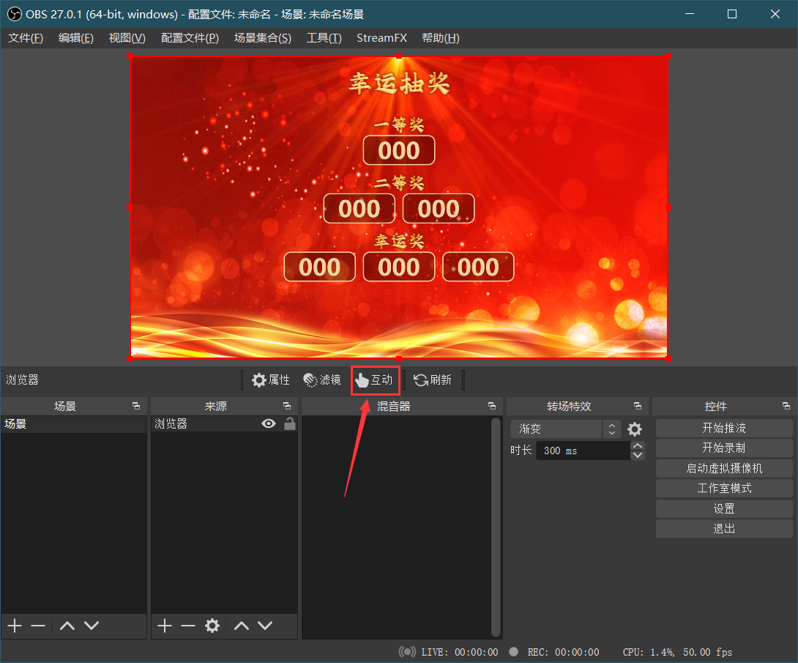
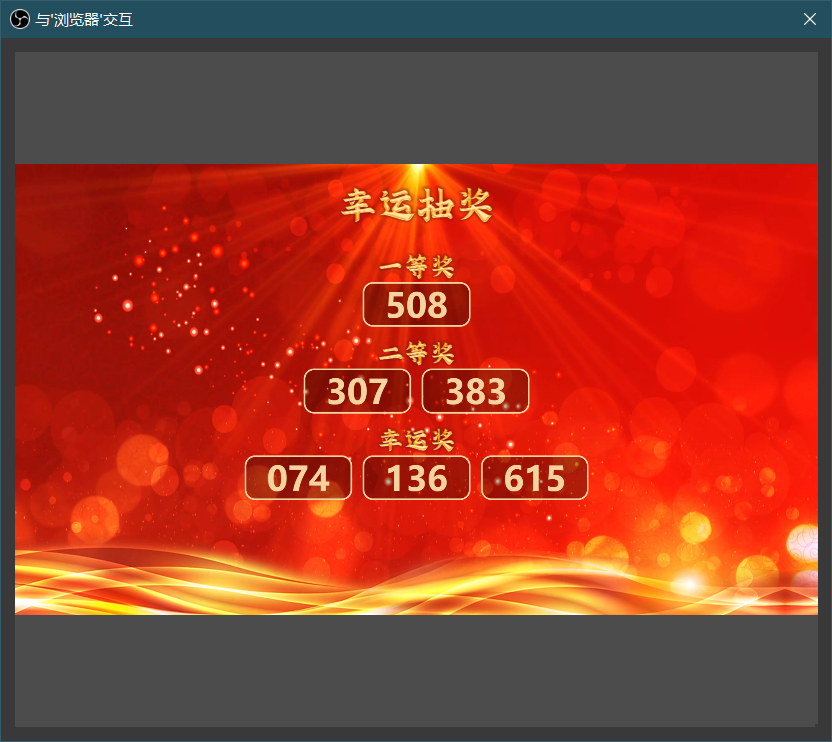

# Web-program-for-event-lottery

用于活动抽奖的网页程序

### 功能

实现一个用于大屏展示的抽奖界面，可以使用浏览器全屏显示、OBS浏览器捕获、vMix网页浏览等方式，将抽奖页面展示于大屏幕

### 预览




### 技术栈

HTML | CSS | JavaScript

### 使用方式

1. 克隆本仓库至本地

2. 使用支持http服务器代理的工具代理 `index.html` ，这里，以 VS Code 为例

   - 安装拓展插件 Live Server
     

   - 打开网页并点击 Go Live
     

   - 得到网址，复制
     
     
   - 除此之外，你还可以使用 `HBuilder X 、Nginx` 等代理 `index.html`

3. 在相应软件添加来源即可，这里，我将使用OBS做演示：

   - 首先打开OBS

     

   - 点击添加来源-浏览器

     

   - 命名源后，点击确定

     

   - 输入从浏览器地址栏复制的地址，并指定宽高为 `1920*1080`

     

   - 点击互动

     

   - 在画面中点击鼠标即可开始/暂停随机数生成

     

4. 可以自由更改的地方

   - 更改随机数范围与位数

     打开 [js/Random.js](js/Random.js) ，找到第30行，根据注释编辑，如下所示：

     ``` java script
     // 生成不重复的随机数
     while (nums.size < 6) {
     	const num = Math.floor(Math.random() * 999) + 1;
     	nums.add(num.toString().padStart(3, '0')); // 将不足 3 位的数字用 0 补齐
     }
     ```

   - 更换背景视频

     同名替换 [video/background-loop.mp4](video/background-loop.mp4) 即可，建议分辨率 `1920*1080px` 

   - 修改显示数字的框的宽高

     打开 [css/index.css](css/index.css) ，找到第85行，如下所示：

     ```css
     .col {
     	width: 200px;
     	height: 80px;
     	margin: 5px 10px;
     	background-color: rgba(0, 0, 0, .3);
     	border-radius: 20px;
     	border: 3px solid #f5d39f;
     }
     
     .num {
     	color: #f5d39f;
     	text-align: center;
     	font-size: 65px;
     	font-weight: 900;
     	transform: translateY(-69px);
     	font-family: "Microsoft Yahei", sans-serif;
     }
     ```

     col 依次为框框的：宽度、高度、外边距、背景色、圆角程度、边框属性

     num 依次为框里数字的：颜色、对齐方式、大小、粗细、Y位置、字体

   - 标题字，请使用PS自行修改，目录： [img/](img/)
     
     
     

### 开源协议

GNU General Public License v3.0

请遵守开源协议合理使用，共建良好开源环境，违者将追究法律责任
